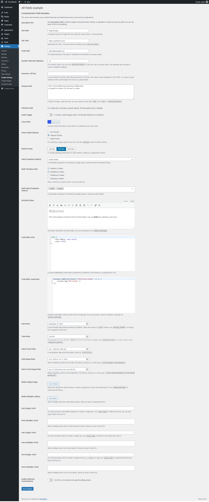
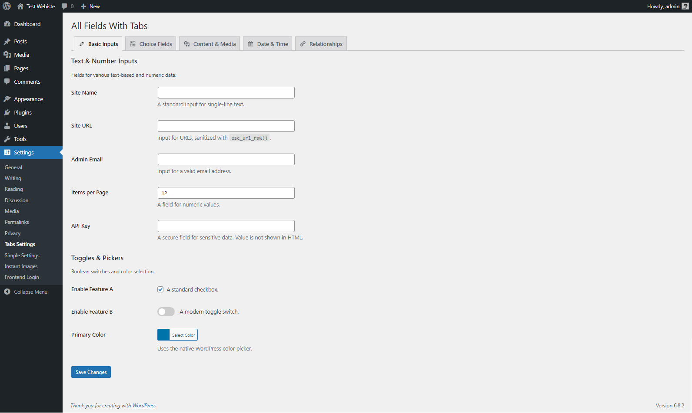

# WP Settings Builder Framework

Stop fighting the WordPress Settings API. This framework provides a modern, object-oriented, and fluent API that streamlines the creation of powerful and maintainable settings pages.

[](https://packagist.org/packages/wptechnix/wp-settings-builder)
[](https://packagist.org/packages/wptechnix/wp-settings-builder)
[](https://packagist.org/packages/wptechnix/wp-settings-builder)

---

## Showcase

Create anything from a simple plugin options page to a complex, tabbed interface for a theme, all with the same clean API.

#### **Simple Layout**

A single page with one or more sections of fields. Perfect for most plugins.



#### **Tabbed Layout**

Organize a large number of settings into a clean, tabbed interface, complete with Dashicons for a native WordPress feel.



## Why This Framework?

-   ✅ **Declarative & Fluent API**: Define entire pages with a clean, chainable API that is easy to read and version control.
-   🚀 **Comprehensive Field Library**: Over 30 field types included, from basic inputs to advanced AJAX-powered relationship pickers.
-   🧠 **Built-in Conditional Logic**: Show or hide fields based on other fields' values without writing a single line of JavaScript.
-   ⚙️ **Intelligent Asset Loading**: CSS and JS are loaded *only when a field that needs them is used*, keeping your admin pages lightweight and fast.
-   ⚡ **High-Performance Relational Fields**: Add searchable fields for Posts, Users, and Terms that load data via AJAX, ensuring excellent performance even on sites with thousands of entries.
-   🔒 **Secure by Default**: Built-in sanitization for all standard field types and secure handling for sensitive data like password fields (values are never rendered in the HTML).
-   🧩 **Truly Extensible**: Designed from the ground up to be extended. Register your own custom field types to meet any project requirement.

## The 3-Step Workflow

The framework follows a simple and memorable pattern:

1.  **`create()`**: Get a `Settings_Builder` instance and create a new `Settings_Page`.
2.  **`configure()`**: Use the fluent methods (`set_page_title`, `add_section`, `add_field`, etc.) to define the entire structure and content of your page.
3.  **`init()`**: Make one final call to `init()` to build the page and register all the necessary hooks with WordPress.

## Installation

Install via Composer into your plugin or theme:

```bash
composer require wptechnix/wp-settings-builder
```

Ensure your project includes the Composer autoloader:

```php
require_once __DIR__ . '/vendor/autoload.php';
```

## Quick Start: A Practical Example

This example creates a settings page with three powerful fields and shows how to retrieve a saved value.

#### 1. Create the Settings Page

```php
<?php
use WPTechnix\WP_Settings_Builder\Settings_Builder;

// Use a named function for better organization
function my_plugin_settings_init() {
    // 1. CREATE: Get a builder and create a page instance.
    $page = ( new Settings_Builder() )->create( 'my_plugin_options', 'my-plugin-settings' );

    // 2. CONFIGURE: Define the page's location, sections, and fields.
    $page->set_page_title( 'My Awesome Plugin Settings' )
         ->set_menu_title( 'My Plugin' )
         ->set_parent_slug( 'tools.php' ); // Places it under the "Tools" menu

    $page->add_section( 'api_section', 'API & General Configuration' );

    $page->add_field( 
        'api_key', 
        'api_section',
        'password', 
        'Service API Key',
        [
            'description' => 'Your secret key is masked and protected.',
        ]
    );

    $page->add_field( 
        'enable_feature', 
        'api_section', 
        'switch', 
        'Enable Awesome Feature',
        [
            'description' => 'Turn the main feature on or off.',
            'default'     => true,
        ]
    );

    $page->add_field( 
        'featured_post', 
        'api_section', 
        'post', 
        'Featured Post', 
        [
            'description' => 'Type to search for a post to feature on the homepage.',
            'query_args'  => [ 'post_type' => 'post' ],
        ]
    );

    // 3. INITIALIZE: Build the page and register all WordPress hooks.
    $page->init();
}
add_action( 'admin_init', 'my_plugin_settings_init' );
```

#### 2. Retrieve a Setting

To use a saved setting elsewhere in your code:

```php
use WPTechnix\WP_Settings_Builder\Settings_Builder;

$settings_page = Settings_Builder::get_instance( 'my-plugin-settings' );

if ( $settings_page ) {
    $featured_post_id = $settings_page->get_setting( 'featured_post', 0 );
    
    if ( $featured_post_id > 0 ) {
        // Now you can use this ID in a WP_Query or get_post().
        $post_title = get_the_title( $featured_post_id );
    }
}
```

---

## Field Reference Table

This is a quick reference for all available field types. For detailed options and examples, see the full documentation guides.

| Type | Description | Saves As | Key Options |
| :--- | :--- | :--- | :--- |
| **Basic Inputs** | | | |
| `text` | A standard single-line text input. | `string` | `default`, `html_attributes` |
| `url` | An input for URLs. | `string` | `placeholder` |
| `email` | An input for email addresses. | `string` | `default` |
| `password` | A secure input for API keys/passwords. | `string` | `description` |
| `number` | An HTML5 number input. | `string` | `default`, `min`, `max`, `step` |
| `textarea` | A multi-line text area. | `string` | `rows`, `cols` |
| `color` | The native WordPress color picker. | `string` | `default` |
| **Choice & Toggles** | | | |
| `checkbox` | A standard single checkbox. | `bool` | `description`, `default` |
| `switch` | A modern, styled toggle switch. | `bool` | `description`, `default` |
| `choice` | Radio buttons for selecting one option. | `string` | `options`, `default` |
| `buttons_group` | A styled, segmented button control. | `string` | `options`, `default` |
| `select` | A searchable dropdown (Select2). | `string` | `options`, `default` |
| `multi_check` | Checkboxes for selecting multiple options. | `string[]` | `options`, `default` |
| `multi_select` | A searchable multi-select dropdown. | `string[]` | `options`, `default` |
| **Content & Media** | | | |
| `wysiwyg` | The WordPress TinyMCE rich text editor. | `string` | `editor_settings` |
| `code_editor` | A syntax-highlighting code editor. | `string` | `mode`, `editor_settings` |
| `media` | Select a single item from the Media Library. | `int` | `media_settings` |
| `media_multiple`| Select multiple items from the Media Library. | `int[]` | `media_settings` |
| **Date & Time Pickers** | | | |
| `date` | A date picker (Flatpickr). | `string` | `display_format`, `flatpickr_options` |
| `time` | A time picker (Flatpickr). | `string` | `display_format`, `flatpickr_options` |
| `date_time` | A combination date and time picker. | `string` | `display_format`, `flatpickr_options` |
| `date_range` | A date range picker. | `string[]` | `display_format` |
| `date_time_range`| A date and time range picker. | `string[]` | `display_format` |
| **Relational (AJAX)** | | | |
| `post` | AJAX search for a single post/page. | `int` | `query_args` |
| `posts` | AJAX search for multiple posts/pages. | `int[]` | `query_args` |
| `user` | AJAX search for a single user. | `int` | `query_args` |
| `users` | AJAX search for multiple users. | `int[]` | `query_args` |
| `term` | AJAX search for a single taxonomy term. | `int` | `query_args` |
| `terms` | AJAX search for multiple taxonomy terms. | `int[]` | `query_args` |
| **Helpers** | | | |
| `description` | Displays read-only text/HTML. | `(not saved)` | `description` |

---

## Full Documentation

For a deep dive into every feature and method, please see the full documentation.

-   **Core Concepts**
    -   [Introduction](./docs/01-introduction.md)
    -   [Getting Started](./docs/02-getting-started.md)
    -   [Settings Page Configuration](./docs/03-settings-page-configuration.md)
-   **Field Guides**
    -   [Basic Inputs](./docs/04-fields-basic-inputs.md)
    -   [Choice and Toggles](./docs/05-fields-choice-and-toggles.md)
    -   [Content and Media](./docs/06-fields-content-and-media.md)
    -   [Date and Time](./docs/07-fields-date-and-time.md)
    -   [Relational (AJAX)](./docs/08-fields-relational-ajax.md)
-   **Advanced Topics**
    -   [Conditional Logic](./docs/09-conditional-logic.md)
    -   [Advanced Guide: Creating Custom Fields](./docs/10-advanced-guide.md)
    -   [Helpers and Methods](./docs/11-helpers-and-methods.md)

---

## Contributing

Contributions are welcome! Please feel free to open a pull request or submit an issue on the [GitHub repository](https://github.com/wptechnix/wp-settings-builder) with your suggestions or bug reports.

## License

This project is licensed under the MIT License. See the [LICENSE](LICENSE) file for details.